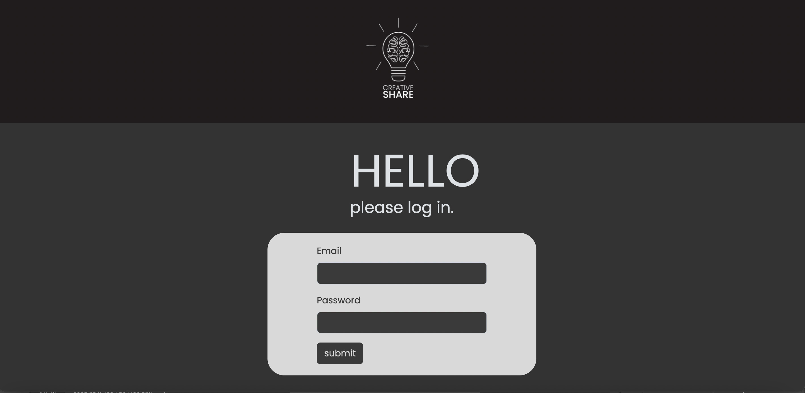

# css-frameworks-ca

A social media application called Creative Share

## Description

Course assignment where we were tasked with creating a responsive front-end for a social media application.

## Table of Contents

- Authentication page
- Feed Page
- Profile Page

## Built With

- Bootstrap
- Scss

### Installing

This is where you list how to get the project started. It typically just includes telling a person to clone the repo and then to install the dependencies e.g.

## Contact

- Email: aashild.rasmussen@gmail.com
- LinkedIn: Aashild L. Rasmussen
- Portofolio: https://aashild-rasmussen.netlify.app/
